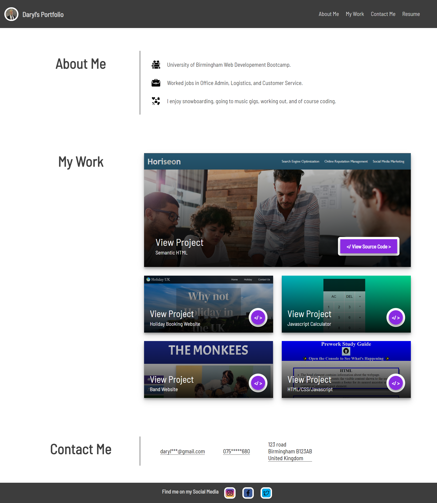
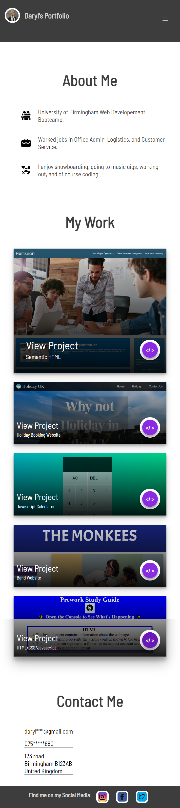

# Daryl Blough Portfolio

## Description
A personal portfolio website used to display my projects and code to any employer or interested party along with a description of myself and ways to contact me.

## Mock-Up

Deployed project should look on a laptop or desktop pc like this 
.
Deployed project should look on a mobile device like this 

## Deployed Project
Deployed project can be viewed here:  .

## Usage
To use this Portfolio, you may navigate though the webpage, clicking on the different projects which will open up the deployed project to view. As well you can view the source code for each project by clicking the link the the relevent project display. As well you can use the displayed contact information to contact myself or follow the social media handles in the footer and find me there. 

## Credits
The icons used in this project were downloaded from a free icon library that can be found here: https://www.flaticon.com/free-icons/work. direct links can be found in the index.html comments.

As well I used and modified a dropdown navbar from Codepen link: https://codepen.io/bloom-dan/pen/vKdoaM.

## License
Please refer to the LICENSE in the repo.

